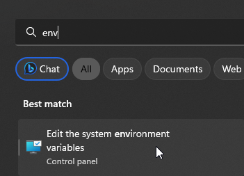
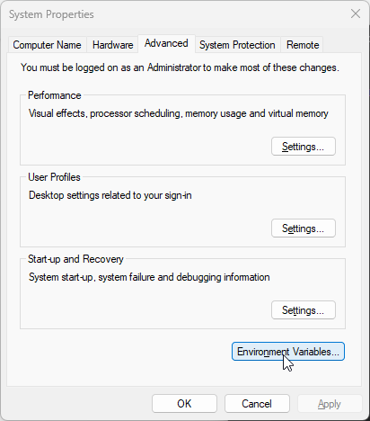
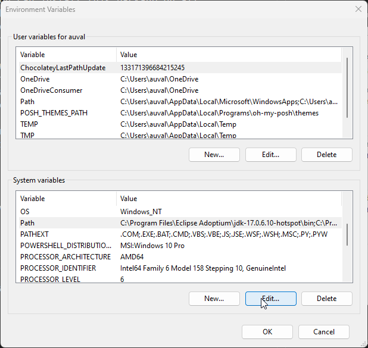
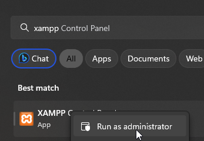
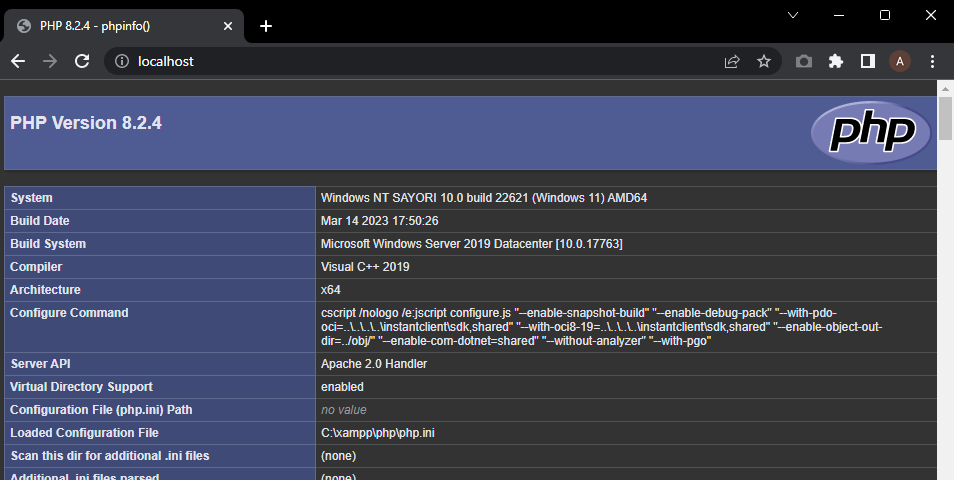

# Getting started

## XAMPP

Download XAMPP from https://www.apachefriends.org/download.html (latest version, 8.2.4, is fine; not sure what version your school uses but I'm gonna HOPE it's either 7 or 8 and you don't need the latest features truth be told). You don't need to open it after starting it up; we'll configure some stuff first.

XAMPP is a couple of softwares in one. It gives you an Apache webserver, MySQL server, PHP support and Perl support. The X stands for Cross-Platform; you can install this package on all kinds of OSes.  There's a LOT of other software you don't need to care about right now too. We are really only concerned with Apache, MySQL and PHP.

XAMPP is stupid in a way; it does **not** set environment variables. Environment variables, and specifically the one named `Path`, allow other software to see certain software globally (such as `php.exe`) and use them at will. So let's make that happen. 

1. Open the environment variables window. You can find this setting extremely easily by searching for "env" in your start menu search.



2. Go to Environment Variables.



3. In the window that pops up, you want to find the Path variable and press Edit.



4. Add the following entries at the bottom:
    - `C:\xampp\php`
    - `c:\xampp\mysql\bin`

You can now press OK on all popups to close everything. If you have something open that requires the path (such as your editor or a CMD window), you need to close and re-open them for the Path to reload in them.

Now, find XAMPP and open it as administrator.



You will want to configure Apache and MySQL as services: this makes it so both are started when your computer is started and takes away some friction every time you start your PC and want to do some programming work.

Just click on the red crosses next to Apache and MySQL, and click Yes in the popup. Now start both Apache and MySQL.

You'll probably notice there's no PHP service. That's because the Apache webserver comes with php support built-in. If it serves a php application, it will execute the php.


## Code editor

Make sure you have a decent code editor. Do you use Visual Studio for everything, or is VSCode (VSC) fine too? I'm writing this up in VSC.

If you use VSC; you probably want to edit some settings. Go to `File > Preferences > Settings` and search for `php`. Click on `Edit in settings.json` under the executable path. This file should contain a line like so:

```json
{
    // There could be other lines before or after this line
    "php.validate.executablePath": "C:/xampp/php/php.exe"
}
```

## Writing a new application

Everything above is a one-time setup hopefully. Everything below is repeated for every php application you write.

Create a new folder somewhere and create a file within it named `index.php` with contents:

```php
<?php 

phpinfo() 

?>
```

Remember or copy the folder path.

Open the XAMPP control panel and click `Config > httpd.conf`.

You want to find the `DocumentRoot` and `<Directory>` options. They should say this:

```php
DocumentRoot "C:/xampp/htdocs"
<Directory "C:/xampp/htdocs">
```

Edit the strings so they match your project directory, and then save. In my case:

```php
DocumentRoot "C:/Users/auval/projects/getting_started"
<Directory "C:/Users/auval/projects/getting_started">
```

If you visit http://localhost now, you should be greeted by the PHP info page. If so, good job; you can now draw the rest of the fucking owl!



(Note: This application will only serve as a backend, so you probably won't have to write any pages you directly navigate to.)